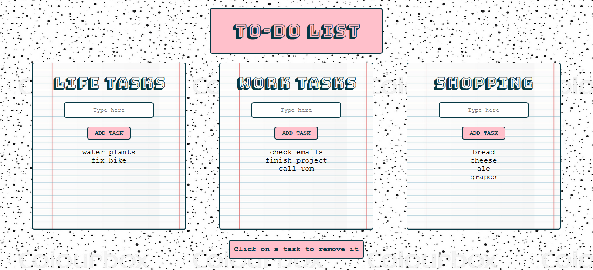

# To-Do-List App

###### August 2020



_I'd been wanting to make a to-do-list app for a while and I am really happy with the outcome of this one. I spent quite a bit of time on the design and I'm really pleased with how it looks. I got it working fairly quickly but there was quite a lot of repetition in my code and I didn't have the data stored in a very efficient way. With a little help, I did a big refactor and got 80 lines of JavaScript down to 47! I've changed the data structure so that the items are now stored in an array (rather than as HTML strings) and that allowed me to store and access the data more efficiently. I learnt a lot during the refactoring process._

### Main Learning Points:

- Thinking about good ways to store data - in this case, an array of objects:

```javascript
const lists = [
  { title: "Life Tasks", id: "lifeJobsList", items: [] },
  { title: "Works Tasks", id: "workJobsList", items: [] },
  { title: "Shopping", id: "shoppingList", items: [] },
];
```

- Accessing data in an object using dot notation and using the index.

- Saving data to localStorage and using the setItem() and getItem() methods on localStorage.

- Using JSON.stringify() to save my array to localStorage (which only takes data in a string format) and JSON.parse() to get the data back out as an array.

- Practiced using the array methods forEach(), splice() and indexOf().

- How to stop a page refreshing on 'submit' when using the HTML form element.
